# シーシャのすゝめ

## 注釈

本稿で記載されている情報は 2020 年 8 月現在のものとなります。
本稿では、可能な限り固有の名詞を出さず、普遍的な情報を取り扱うことを心がけています。しかし、シーシャのフレーバーやカフェに関する情報・情勢は日々変わりつつあり、陳腐化しやすいということをご留意の上お読みください。

また、可能な限り ※1 のような形で引用、出典元などを示すようにします。引用、出典元詳細については本項の最後にまとめて記載します。

## シーシャってなんだ

### シーシャ概要

日本国内でじわじわ広まりつつあるシーシャ（水タバコ）。もしかしたらこちらの寄稿を読む皆さんももしかするとご存知かもしれません。
エジプトなどに行くと街なかでおっさんがダラダラしながら煙をくゆらせてるアレです。

- 
  - 図:シーシャを吸ってる中東のおっさん(Google 画像検索より)

シーシャは４つのパーツから成り立っています。水を入れるためのガラスでできた底部（ボトル）。そこから上部へと伸びる胴部のパイプ（ステム）、この部分は真鍮（もしくはステンレス）でできていて、フレーバーを詰めて炭をのせる頭部のボウルまで続きます。最後に胴部の中程から吸い込む部分（マウスピース）へと伸びるホースです。

炭がフレーバーを温め、ステムにつながったホースから煙を吸い込むと、「ボコボコ」という心地よい音ともにボトルの水を煙が通り、果物やお菓子の香りの美味しい煙をたのしむことができます。

紙タバコの広まりによってシーシャは降下減少の中にありましたが、日本を含む世界的にまたじわじわブームにもなりつつあります。

古来からシーシャは日々のストレス解消やリラックスのため、友人や家族と語らうコミュニケーションの場に用いられてきました。一度の喫煙時間は作り方にもよりますが、40 分〜3 時間。なにもない、人生にとって必要すらない時間をつくり、ただひたすら美味しい煙を楽しむこと。意外と現代人にとっても必要かもしれません。

シーシャカフェに行く、あるいは自宅に道具を買って作ってみる。楽しみ方は人それぞれ。シーシャを作ってダラダラしながら会話を楽しむ。吸いながら本を読む、映画を見る、あるいはシーシャだけではなくお茶やお菓子とともに組み合わせを楽しんでもよいでしょう。

純喫茶同好会の同人誌を手にとってくれた皆さんに、これよりシーシャの歴史や作り方、文化そのものをお伝えしたいと思います。

### シーシャに関わる呼称など

後述の歴史の部分でも触れますが、水タバコはインドから中東に渡り広域に広まった文化でもあります。すなわち、呼称なども地域によって異なっています。だいたい呼称は以下のとおりです

- シーシャ (Shisha, あるいは Sheesha)
  - エジプトを始め北アフリカのマグリブ諸国で主に用いられる名称。日本国内や英語圏でも使われています。本記事では主にシーシャ呼称を用います。
  - 英語圏や英語圏の通販サイトでは水タバコ全体や、水タバコのフレーバーそのものを表す用語としても使われています。
- フッカー（Hookah)
  - インドやパキスタンで主に用いられる名称。ヒンディー語・ウルドゥー語に語源があるらしい。これが植民地期に英語へ伝わったことより英語圏で用いる場合もあります。
  - 主に英語圏、英語圏の通販サイトではボトルとステムを合わせたシーシャパイプそのものを表す用語として用いられるようです
- ナルギレ (Nargile)
  - 現在のトルコで用いられる名称。トルコ以外にも、これと同系統の名称がシリア地方やバルカン半島など幅広い地域で用いられる。
  - 広域で用いられるので、ナルギーレ、ナルジーレ、ナルギーラ、アルギーレ、アルジーレ、アルギーラなど、様々な発音があるとのこと。
- ガリヤーン、ゲリユーン（Galyan）
  - 現在のイランで主に用いられる名称。ペルシャ語。
  - イランで「シーシャ」というと主にマリ ○ ァナを表す意味になるため、こちらを使うとのこと。（イランに留学したフォロワーさん談）

### シーシャの歴史

#### 起源

シーシャの起源は諸説ありますが、
一般的に水パイプの発祥はインドとされ、約 700 ～ 800 年前にココナッツの実をくり抜き、竹の棒を差したものが原型とされています。

当時は品質の悪いタバコしか手に入らなく、悪質なタバコをなんとか美味しく吸えないものかと、タバコの葉を糖蜜に漬け込んだ物を炭で燻し、煙を水で濾過しながら吸うという工夫から水タバコが生まれたようです。

それがアラブ諸国に伝わり、約 500 年前に現在見られるガラス細工や陶磁器のシーシャがトルコで誕生したとも言われます。

その他、エジプトにて粗悪なタバコを美味しく吸えるようにするために生まれた、なんていう説。
（以上 ※1 ）

イランの「シャハッパスィ」という王様が川沿いで、水の音を聞きながらリラックスして紙タバコを吸っていた。しかし、冬だと川に行けないため、お家でもこういう環境を作れるないか？ と言って、シーシャになったなどという説もあるとか。（※2）

などと歴史を紹介しましたが、インドのムガル帝国にタバコを伝えたのはイエズス会で、16〜17 世紀ごろのお話、それまでに吸われていたのは大麻だった、なんて話もあるようです。(※3) 少なくとも、ユーラシア大陸にタバコが持ち込まれたのが、コロンブスによる新大陸発見の 1492 年以降のお話であることは考慮に入れなければならないでしょう。（シーシャっぽい方法での喫煙があったにせよ、たぶん別の「何か」を燃やして吸っていたんじゃないかと筆者は推測しています）

なんにせよ、17 世紀頃には現代のシーシャに通ずるタバコの喫煙スタイルが確立していたようです。

ちなみに、アメリカのフレーバーメーカー Fumari 社のページにて興味深い内容が取り上げられていました。(※4) 今日見かけるようなシーシャパイプの登場についての内容ですが、要約すると

- 16 世紀のインドにイギリス東インド会社がガラスを持ち込んだ結果、ガラス製造産業が広がる
  - 同時期に、インドの上流階級の間でタバコ喫煙がブームに。結果として、ガラスボトル内の水を煙のフィルターに使う水パイプを用いた喫煙スタイルが発明される。
- 17 世紀には水タバコがペルシャ文化の一部となる。木工でステムが作られ、このころステムのデザインが確立。
  - (備考: ※2 の出典詳細に登場する春日部のシーシャカフェ Patisa さんでは実際にイラン製の木製ステムが使用されています)
- 18 世紀ごろ、水タバコがトルコの文化に吸収され、イノベーションが起こる。
  - 鍛冶屋が鋳造により真鍮製で複雑な紋様を刻み込んだ金属製ステムを製造しはじめる。

といったところです。シーシャの起源や歴史に関する記事を複数調べましたが、起源はさておき現代のシーシャにつながる成立過程として、上記は非常に納得にいく説明だと筆者自身は感じました。歴史において、イギリスの名前が出てくると大抵 ~~ブリカスの所業~~ なんらかの問題がつきまとうのですが、シーシャの成立に関わっていたとなると大英帝国様様です。

ところで、読者の皆さんもイスラーム教の聖典「クルアーン」の成立が 7 世紀であることをご存知かもしれません。イスラーム教においては、飲酒が禁止されています。中東でのコミュニケーションツールとしてのシーシャの普及には、「クルアーンが書かれた頃に存在しないものは禁止されなかった」という事実が関わっていそうです……

#### 現代のシーシャ文化の広まり

現在の様な、甘い香りのシーシャが生まれたのは意外と最近で、1980 年代のこと。

1989 年 (※5) にエジプトのナハラ( Nakhla )社がフルーツフレーバー「ダブルアップル」を販売したところ大ヒット。フルーティーな香りの美味しい煙は、おっさんだけではなく若者や女性をも虜にし、グレープやレモンミントと言った様々な香りのシーシャフレーバーの発売に繋がります。

だいたいの現代文化がそうなのかもしれませんが、例のごとく中東でのシーシャのブーム、再興にアメリカ人を目をつけます。「俺たちでも作ってみようぜ！？」などと言ったかどうかはわかりませんが、アメリカでもシーシャフレーバーの製造が始まります。

案の定、アメリカ人は合理性を気にすることから、シーシャに関しても便利な道具を発明しだします。ボウルの上に、炭をそのまま置くだけでは難しい火力の管理を簡単にする「ヒートマネジメントシステム」を始めとして、便利な道具が生まれたのはこの頃からです。

- 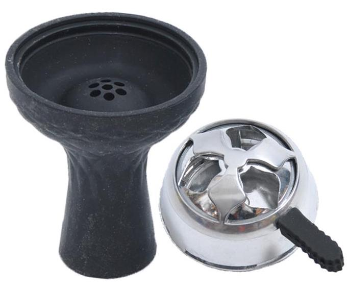
  - 図: ヒートマネジメントシステムの代表的な製品のひとつ「Kaloud Lotus」とシリコンボウル

その後、アメリカをはじめとして、欧州、ロシアなど先進国でもフレーバー製造やシーシャカフェが普及しました。（ドイツではトルコ系移民が多いことも普及に一役買っているかもしれません）

また、例のごとく中国でもシーシャに関わる道具やフレーバーが製造されています。筆者が Alibaba などで中国の製造元情報を追っていくと、「浙江省金華市義烏」となっていました。義烏は世界最大の日用品取引の中心地。ダ ○ ソーやキャ ○ ドゥで売っている商品は一定の割合で義烏が関わっています。日用品の大量製造ノウハウがシーシャ用品にも活かされていいるのかもしれません。

日本においても、21 世紀初頭よりシーシャを吸える場所が広まりつつあります。
2015 年頃より、東京、大阪、名古屋を始めとする都市圏を中心に一気にシーシャカフェが増え、いまや全国各地でシーシャを楽しめるようになりました。

### シーシャの楽しみ方

#### シーシャカフェに行こう（オーダー編）

初めてシーシャを吸う。そんなあなたはまずシーシャカフェに行ってみよう。

シーシャカフェの値段の相場は土地にもよるが、シーシャ 1 本、ドリンクで 2 時間〜3 時間滞在できて 1800〜3000 円と考えて良い。ワンドリンク制や、チャージにフリードリンク飲み放題がついているなど店によってシステムは異なるので事前にチェックしておこう。

店に着いたらまずはシーシャのオーダーから。
初めてのシーシャを体験する際や、吸い慣れていない方はその旨店員さんに伝えると、吸いやすいように作ってくれる。味の好みは店員さんが聞き出してくれるが、以下のことを想定しておくといいだろう。

- 好みのフルーツ
  - 初めてだと好きなフルーツをオーダーすると良い。味がわかりやすく、シーシャがどういうものか？を体験するのにちょうどよい。
  - 割と色んな種類のフルーツがある。下記はその一例
    - アップル
    - ピーチ
    - 柑橘（レモン、オレンジ、グレープフルーツ等）
    - ベリー系（グレープ、ブルーベリー、ラズベリー等）
    - メロン
    - スイカ
    - ザクロ
    - トロピカルフルーツ（マンゴー、パイナップル、ライチ、パッションフルーツ、グアバ等）
- 甘い or さっぱり
  - 同じフルーツでも色んな味の引き出し方がある。例えば、同じグレープでも日本の葡萄のように甘くジューシーにしたいのか？あるいは、マスカットのようにさっぱりさせたいのか？
- ミントを入れるかどうか？
  - ミントを入れるとさっぱりして吸いやすくなる。入れる場合は以下のどちらのミントがいいか伝えよう
    - ミントそのものの甘さと清涼感（ミントティーをイメージしてほしい）
    - 清涼感だけを出す（メンソールのタバコやガムのイメージ）

以上の想定を伝えると店員さんもとても作りやすい。
わからなかったら色々店員さんに質問してみよう。また、吸い慣れた方は店員さんに在庫を聞きながら好みのメーカーのフレーバーをオーダーするのもよいだろう。

#### シーシャカフェに行こう（注意点編）

シーシャカフェに行く際に必ず守って欲しい注意点がいくつかある。楽しい時間を過ごすためにも必ず以下の事項を守って欲しい。

- 道具に絶対に触れない
  - シーシャの道具に触れていいのはそのお店の店員さんだけである。燃えた炭を扱っている以上、倒したりすると火事や火傷のリスクがある。自分だけが火傷をするならともかく、他のお客さんを巻き込む可能性があることは頭に入れてほしい。また、破損させたときはもちろん弁償が必要である。なんだかんだ言ってシーシャの道具は高額だ。
  - トイレなどで席を立つときにはまわりを確認して倒さないように気をつけること。お店にもよるが、通路が狭くてうっかり…なんてことも起こりうる。
  - 荷物の関係や、出入りする箇所の狭さなどでどうしてもシーシャボトルを動かしたほうが安全である場合は、かならず店員さんに声をかけて相談してほしい。
- お店のルールを守る
  - お店によって、ドリンクやフードの持ち込み可否、シーシャ以外のタバコ類（紙巻き、電子タバコなど）の喫煙可否などルールは異なる。必ず確認してルールを守ろう。お店に敬意を持って楽しいダラダラタイムをすごしてほしい。
- 年齢確認できる身分証明書を持っていく。
  - シーシャはタバコと同じ 20 歳から解禁だ。法改正によって、店舗側の規制が厳しくなっている。かならず免許証などの身分証明書を持っていこう。忘れたら基本的にお店に入れないと思っていい。（見た目年齢は関係なく、それがルールだ）
- 体調不良、空腹、極度の満腹でのシーシャはさける

  - 「体調悪いけどシーシャを吸いたい。」などというのは厳禁だ。体調が悪いときはだいたいシーシャの煙で余計気分が悪くなる。またマウスピースを変えて接触は避けているとはいえ、同じホースを使って火力調整をしている以上、感染症のウイルスなどを店員さんにうつすリスクだって 0 ではない。シーシャは元気になってから。
  - 空腹時はシーシャの煙で気持ち悪くなりやすい。特に、シーシャを吸い慣れていない方は特にその傾向が強い。1 時間前に食事をとる。あるいは店に行く前にサンドイッチなど軽食をとってほしい。また、極度の満腹状態では気持ち悪くなって吐き気がする場合もある。多くても腹八分目でセーブしておこう。

- 水分補給はしっかり。
  - 水分不足はシーシャで気持ち悪くなる可能性につながりやすい。夏場の熱中症対策と同様にしっかり水分、塩分をとっておくといい。アクエリアスやポカリスエットを呑んでおくといいかもしれない。

上記に注意しておけばだいたい問題ないと思う。シーシャを吸って気持ち悪くなった場合は吸うペースを落とす。それでも無理だった場合は店員に伝えた上で外の空気を吸うなどをしてほしい。ルールやマナーを守る、そして自分の体調をしっかり管理することが基本なので頭に入れておいてほしい。

また、お店に行く前に予約や連絡を入れることをおすすめする。シーシャカフェは小さな物件の店舗が多いため、曜日や時間帯によっては混雑しやすい。1〜2 名でも、連絡を入れておくと炭焼のタイミングなどの関係上、お店にとってはとてもありがたい。3 人以上になると席確保の兼ね合いもあり予約は必須だ。

#### 吸い方（初級編）

正直に言って、シーシャの吸い方を文章で伝えるのはとても難しい。紙巻きタバコとは美味しい吸い方も異なる。とりあえず、シーシャカフェに言って店員さんに尋ね、店員さんの吸い方のマネをするとよい。

あえて文章にするなら基本は以下の通りだ。

- 深く長く吸う
  - お腹を使った深呼吸のイメージでできるだけ長く吸ってあげよう。ボトルの中の水がボコボコと音を立てていれば強さは問題ない（店員さんと同じくらいボコボコ音が鳴るとなおよい）。意外なことに、躊躇して吸ったほうがむせやすい。しっかり深く長く吸ってあげよう。
- すぐに吐き出す
  - 吸いきったらすぐに口を大きく開けて、吐き出してあげること。紙巻きたばこを吸っている人は、煙を口にためることがよくある。口にためると、むせやすく、また味が薄くなってしまう。
  - シーシャは吐き出すときに味がする。紙巻きタバコのように口を細めて「フーッ」と吹き出すとじつは香りを感じにくい。口を大きく開けて「ハーッ」と吐き出そう。

吸う頻度は自分の体調に合わせてペースを見つけてほしい。30 秒〜1 分に一度くらいが目安だ。吸いすぎても、逆に放置しても炭の火力が荒れてフレーバーの状態がわるくなることがある。

喉のイガイガ感など、違和感を感じたら店員に一声かけると調整してくれる。

#### 吸い方（中級編〜）

まずは基本の吸い方ができるようになったら中級編だ。
中級編以降は、極めて文章に表すことが難しいため、ポイントと到達目標のみ記載する。シーシャを吸い慣れていく過程で身体で会得してほしい。

シーシャにはどのフレーバーにも味が美味しくなる温度帯がある。美味しく味が出る上限の温度を超えるとフレーバーが焦げてしまうし、逆に下限の温度を下回ると煙が出なかったり、むしろ焦げているときと同様に喉に違和感を感じる場合もある。中級編としては、このときの違和感をしっかり感じ取れるようになることは目標だ。
中級の吸い方ができるようになると、自宅シーシャを始めたときに炭の調整ができるようになる。

以上ができたら上級編。炭の量や起き方だけではなく、吸い方でフレーバーの温度をコントロールすることが目標だ。煙の良し悪しを感じ、吸いながら温度が上がっている、下がっていることを感じる。そして、それに合わせて吸いの強さや深さを調整することで温度をコントロールする。ここは、じつは紙巻たばこや葉巻を上手に吸うことにもつながるかもしれない。実のところ、普段から葉巻を吸っている人はシーシャも上手に吸える方が多い。

上級編ができると、自宅シーシャの腕も上がり、また大抵のお店で美味しくシーシャを吸うことができる。

ぶっちゃけていうと、シーシャの作る上手さは作り手の吸い方の上手い下手に関わってくる。このあたりはシーシャの沼にハマるとそのうちきっとわかるはず（たぶん）。上級編よりも上の世界もあるのだが、もはや書いていくとキリがない奥深い世界なので、気になる方はシーシャ道を追求していってほしい。

## シーシャのフレーバー

### 産地、メーカーなど

シーシャは世界各国で製造されている。筆者が認識している限り、フレーバーの産地はだいたい下記の通り

- 中東
  - UAE
  - ヨルダン
  - エジプト
  - トルコ
  - イラン（2020 年現在、西側諸国の経済制裁の影響か日本にはあまり出回っていない。）
- アメリカ
- ヨーロッパ
  - ロシア
- 東、南、東南アジア
  - 中国
  - インド
  - インドネシア
  - マレーシア（輸出制限があるらしく日本にはあまり出回っていない）

アメリカ製のフレーバーは比較的初心者にも吸いやすいものが多い。ロシア系フレーバーはダークリーフのタバコを使用しているものが多く、ニコチン量が多いため吸うときは注意が必要だ。

シーシャを吸い慣れてくると、なんだかんだいって中東のフレーバーの美味しさに気づく。中でも、ドバイの AlFakher (アルファーヘル) 社のものは優秀だ。特筆して美味い、初めて吸ったときに感動するようなフレーバーがあるわけではないが、どのフレーバーも外れがほぼない。なにより重要なこととして、吸ってて飽きのこない味である。いろいろ試した末にそこに戻ってくる、例えるならばマク ○ ナルドのポテトや、日清カップヌ ○ ドルのような存在だ。
（ただし、AlFakher 社は世界中に生産拠点があるため生産地によってばらつきもある。UAE のものはむちゃくちゃ美味い。インド製造のものは控えめに言ってクズだ

### フレーバーの種類

「シーシャカフェに行こう（オーダー編）」でも一部触れたが、シーシャのフレーバーは実に様々でフルーツやミント以外にも色んな味のフレーバーが発売されている。以下はその 1 例だ。

- 飲み物系
  - アールグレイ
  - カプチーノ
  - ターキッシュコーヒー
  - マサラチャイ
  - コーラ
- お酒、カクテル系
  - モヒート
  - ピニャコラーダ
  - テキーラサンライズ
  - リモンチェッロ
- お菓子
  - チョコレート
  - ホワイトグミベアー（ハ ○ ボーのアレを再現）
  - ガム
  - シナモンケーキ
  - ブルーベリーマフィン
  - チョコミント
  - アイスクリーム
- スパイス
  - カルダモン
  - シナモン
- お花、お香系
  - ローズ
  - ジャスミン
  - レモングラス
  - パンラズナ

などなど。他にもたくさんのフレーバーがあり、挙げていくと本当にきりがない。

なお、筆者の個人的なおすすめはパンラズナ。名前だけ聞くとどんな味、香りがするフレーバーなのか解らないが、例えるならば白檀のお香のような香りのフレーバーだ。あまりの強烈な香りに、製造メーカーによっては一度吸うと匂いが取れないことから、パンラズナ専用のパイプを用意しているシーシャカフェも多い。
ただ、その特徴的な香りと味は吸う人を魅了する。シーシャをある程度吸い慣れた人に「一番好きなフレーバーは何？」と尋ねると、ダブルアップル、レモンミントについで名前が挙がるのがパンラズナである。ただし、あまりに特徴的な香りが仇となり、パンラズナは人によって好き嫌いがはっきり分かれるフレーバーでもある。
「はじめてシーシャを吸うんですが、オススメの味を教えて下さい」と言ったときにニッコリ笑って「パンラズナだよ！」というおじさんには絶対に近づいてはならない。

### つくる時の難しさ

「吸い方（中級編〜）」の項目にて

> どのフレーバーにも味が美味しくなる温度帯がある

という記載をしたと思う。シーシャのフレーバーは味によって美味しさが引き出る温度帯、作りやすさが異なってくる。

例えば、ダブルアップルはあまり温度が高すぎるとアップルよりもリコリスの香りが強くなる。また、パイナップルやバナナのような一部の果物のフレーバーは、糖分によって焦げやすい。

自宅でシーシャを作ることに興味を持った方むけに、フレーバーの難易度を下記にまとめる。あくまでも一部しか触れていないこと、また筆者の経験をベースとした主観であることはご留意いただきたい。

#### 初心者

- ミント系（レモンミント、スイカミントなどはじめからミントとミックスされたフレーバーを含む）

#### 中級者

- ダブルアップル
- パンラズナ
- 柑橘
- 甘い系
- お茶系（ジャスミンとローズは除く）

#### 上級者

- バナナ（火力管理に難あり）
- パイン
- もも（※）
- マンゴー
- グレープ（※）
- ベリー系
- ココナッツ
- コーヒー

正直なところ、ダブルアップルは中級者向けかどうかは議論があると思う。同時に、ダブルアップルをしっかり作れるように鳴ると基礎がしっかりできていることにつながるため、あえて中級者欄に入れた。ただし、基礎というやつはどうも難しい。

また、（※）印の着いたフレーバーは、ある程度シーシャを作るのが上手になると難しさに気づくフレーバーだ。それっぽい香りを出すことはできるが、しっかりと味のニュアンスを引き出すのがなかなかに難しい。

大体のシーシャやさん店員はどのフレーバーも美味しく作れるよう日々精進しているはず…である。ただし、店員さんの作る上手さは店員さん自身の吸い方に依存している。つまり、シーシャが美味しい状態にあるか見極める能力が大事ということ。シーシャやさんが増えたことで、筆者自身が「上手だな」と思うシーシャ屋さんは減りつつあるのも現状だ。

## お家シーシャの作り方

シーシャカフェに通って、「自分でも作ってみたい」「お家シーシャしたい」となってしまったあなたにお家シーシャの作り方、揃えるものなどを紹介したい。また、後述の「つくりかた」欄にあわせて一部商品をおすすめする。

### そろえるもの

まずは道具を揃えよう。基本的な道具は通販、あるいは物販をやっているシーシャカフェで揃う。必要なものは以下の通りだ。

#### シーシャパイプ

これがなかったら始まらない。色んな種類のものがあるが、相場のめやすは 8000 円〜25000 円ほど。
個人的なオススメはエジプシャンパイプと言われる伝統的な形状のもの、それも 70cm 以上の大きさのものだ。

- 
  - 図: Khalil Mamoon 社のエジプシャンパイプ

「大きいから洗うのが大変」とか「まずは小さいのがいいのでは？」という疑問があるだろう。しかし、そんな疑問を補ってあまりあるメリットがある。
一つには吸い心地の良さだ。シーシャカフェの多くで未だに伝統的なエジプシャンパイプが使われている理由は、吸い心地の良さにある。パイプから伝わるしっかりしたボコボコ感は、エジプシャンパイプならでは。自分の吸いの力加減がわかりやすく、吸い方が上手になる。
また、家シーシャにハマると大きいパイプを買った場合は「持ち運べるように小さなパイプがほしい」とか、逆にはじめに小さいパイプを買った場合も「お店と一緒の吸い心地がいいからエジプシャン買おう」となってしまうのだ。まずはエジプシャンパイプを買おう。
エジプシャンパイプといっても様々なブランドのものがある。若干お値段するものの Khalil Mamoon（ハリルマムーン）か Shika Hookah（シカフーカー）というブランドの商品をおすすめしたい。どちらも名門の製品でつくりがしっかりしている。シーシャカフェでよく使われているのは Khalil Mamoon 製品だ。
Shika Hookah の製品は、ステム部分が真鍮のどっしりと重い素材で作られているパイプが多く、こちらは吸ったときにパイプから伝わるボコボコ感が他のブランドのものとぜんぜん違う。筆者の好みは Shika Hookah の製品である。

#### ボウル（ハガル）

フレーバーを盛るボウル、これも必需品だ。もしかするとパイプを買ったときにおまけで付いてくるかもしれないが、別途追加で買っておくとなんだかんだ便利だ。

市販されているものの素材はだいたい陶器・磁気・シリコンのいずれかだ。シリコンボウルは落としても割れない、熱を安定させやすいというメリットがある。しかし、陶磁器のボウルに対し熱伝導性に劣るため立ち上げが難しく、意外と難しい部分もある。個人的には陶磁器製のものがオススメだ。

また、形状にも種類があり、主にストレートタイプとファンネルタイプが有る。ストレートタイプはフレーバーを盛る部分の底に穴があり、シロップが多いフレーバーからはシロップが下に落ちてしまうというデメリットはある。ただし、中東系のフレーバーを作る場合には特に問題にならず、むしろしっかり味を楽しめる。ファンネルタイプは煙突形状の穴があり、穴の周りの部分にフレーバーを盛るという形。こちらはシロップが多いアメリカ系フレーバーを美味しく吸うのに向いているだろう。

- 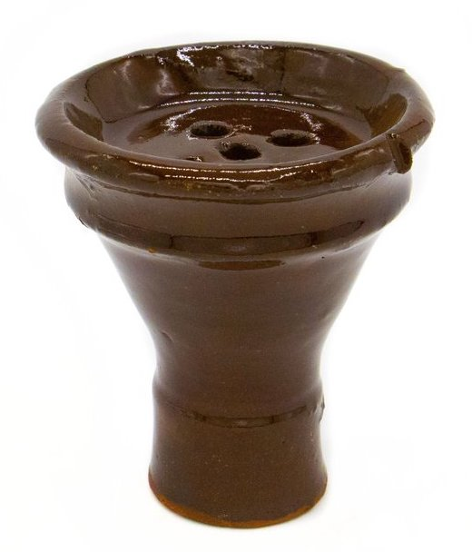
  - 図: ストレートボウル
- 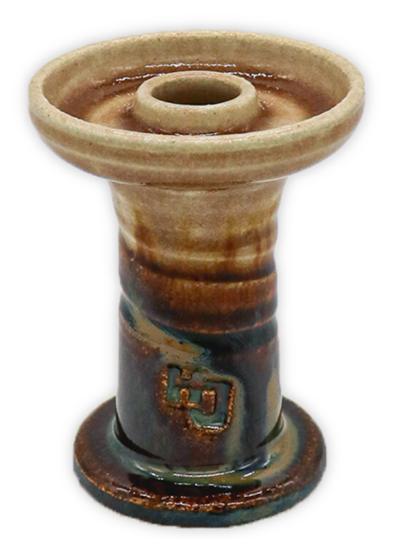
  - 図: ファンネルボウル

筆者のオススメは昔ながらの陶器素焼きの「ターキッシュボウル」と呼ばれるものだ。日本国内でも販売店や作り手、地方などによって呼称が違っていたりする。画像のようなフレーバーを入れる箇所の断面が半球状になっているものを便宜上ターキッシュボウルと呼ばせていただきたい。

- 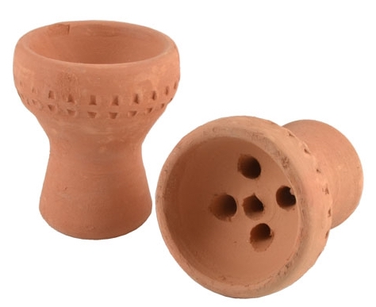
  - 図: ターキッシュボウル

ターキッシュボウルは価格が 450 円〜800 円ほどで手に入れられる。他のボウルと比べ安価で割っても気にならない価格だ。2 つほど手に入れておきたい。
また、ある程度自宅シーシャに慣れたら、ファンネルタイプのものを購入すれば良い。

#### ホース

シーシャを吸うためのホースだが、たいていパイプを買ったときにおまけで付いてくる。ただし、あらえないタイプのものが着いてくる場合が多い。プラスチック製で使い捨ても可能なウォッシャブルのものを何本か購入しておくといい。洗って何回か使って、匂いがどうしても取れない場合だけ捨てればよい。筆者が知る限り値段は 300 円〜/1 本 だが、5 本まとめ買いして 1000 円みたいな場合もあるのでいろいろ調べてほしい。「ウォッシャブルホース」とか「ヌーホース」で調べると出てくる。

#### ヒートマネジメントシステム（ HMS ）

わりといろんな商品がある。あったら便利だが、ボウルに合わせたものを購入する必要があったり、性能が一長一短なので「この製品が良い」みたいなお薦めはできない。だいたいどの製品も 3000 円〜が相場である。

筆者は、複数の HMS を所持しているが、最近圧倒的に安価でそれなりに使える代用品を見つけたので紹介したい。ここでお金を節約した分でフレーバーを購入してほしい。

その代用品はなんと近所の 100 円ショップで売っている。排水溝用のごみ取りネット(直径 70mm)とキッチン用アルミパネルだ。

- 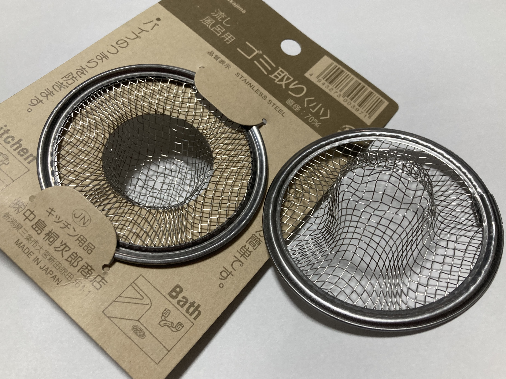
  - 図: ごみ取りネット
- 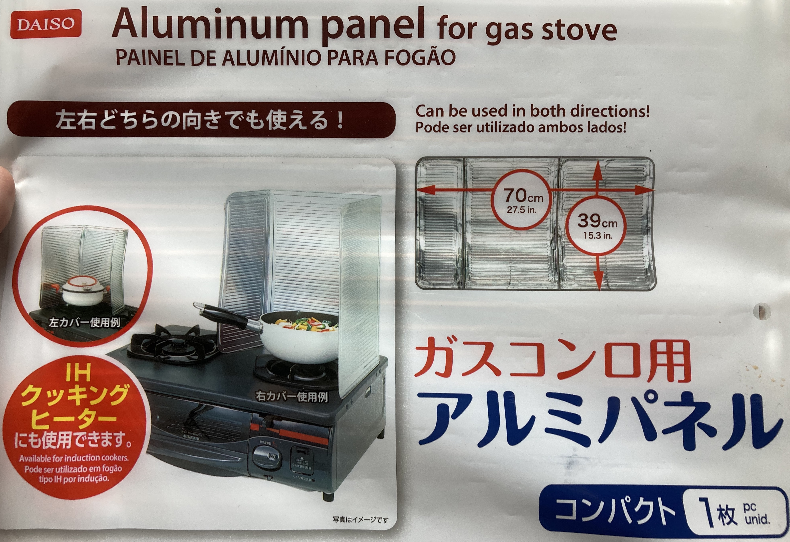
  - 図:アルミパネル

ごみ取りネットに関してはステンレス製のものと銅製のものが売っているが、強度的な意味でステンレス製のものをおすすめする。また、初めて使う際には金属臭を取るため、炭と一緒に電熱コンロなどの上にのせて焼いてあげるとよい。

ところで、読者の方は「こんなものが本当に役に立つのか？」という疑問を持たれるかもしれない。そこで、疑問に解答しよう。まず、HMS を使わない場合はフレーバーを盛ったボウルにアルミホイルを張り、空気穴を開けたところに炭を直接のせて作るという作り方をする（以降、「直載せ」と表現）。中東では基本的にこの炭直載せスタイルが定番だ。ところが、直載せの場合時間経過で燃えて小さくなった炭が、アルミホイルのたわみによってボウル中央に転がり、フレーバーの温度が上がって焦げる場合がある。また、炭とフレーバーの距離が近いため吸い方による温度管理がなかなかに難しい。
そこで、アルミホイルを張ったボウルの上にごみ取りネットを置いて、その上に燃えた炭を置く。こうすると、以下のようなメリットがある

- アルミホイルのたわみで炭が勝手に動くことがない。
- 炭とフレーバーの距離をごみ取りネットの厚みの分だけ離せるので火力が安定しやすい。
- ボウルの外周部に炭があることにより、ボウル全体が温まる。
  - 温められた空気によってフレーバーに熱を与えるより、陶器のボウルから熱が与えられる方が効率が良く、香りがしっかりでてフレーバーが焦げにくい。
- アルミホイル直載せより、ネットの上に乗せるほうが炭の接触面積が少ない。これにより黒く焼け残った部分が減り、一酸化炭素を発生させにくい。

嬉しい事だらけである。また、アルミパネルは折り曲げて筒状に組み立て、風防として利用する。立ち上げ時や、炭が小さくなり火力が低いときに利用すると輻射熱でボウルがしっかりあたたまる。なお、そのままでは筒の上からしか空気が入らずに吸ってるときに酸欠になるかもしれないので、キリやアイスピックなどで周囲にたくさん穴を開けることを推奨する。

- 
  - 図：アルミパネルで作った風防

#### 電熱コンロ

炭を焼くのに必要だ。家庭用ガスコンロは火災防止センサーがついているため、炭焼に適さない。専用のものを用意すると圧倒的に便利だ。カセットコンロでもいいが、電熱コンロのほうが安全でコスパが高いと思われる（たぶん）。

筆者が愛用しているのは、大手通販サイトの amaz○n にて「石崎電機 電気コンロ」で検索すると出てくる商品 (ASIN: B01EWIIIFY) だ。同じ用途で使用する購入者が多いためか、関連商品にシーシャ関連グッズが表示される。

#### 炭

燃焼剤が添加されている一般の炭ではシーシャの味を邪魔してしまう。シーシャ専用のココナッツ炭を購入してほしい。フラットタイプとキューブタイプがあるが、使用する HMS によって選ぶといい（キューブタイプの場合、HMS に入らずにトングで割る必要がある場合もある）。

通販か、物販をしているシーシャカフェの店頭で購入できる。2020 年 8 月現在、筆者は東京都目黒区自由が丘のシーシャカフェ、「カンノーク」さんにてキューブタイプのものを購入している。「カンノーク」さんは日本中のシーシャカフェに炭を卸しているので品質もお墨付きだ。 ~~普段お世話になっているのでこういう場でステマをしておく。~~

#### その他

- トング
  - 燃えた炭を手で持てる方はいらないかもしれない。シーシャ専用に売られているトング（先が尖っている）を用意すると、必要に応じて燃えた炭を割ることが出来て便利だ。
- 床に敷く布
  - 誰もが 1 度は炭を落として床を焦がす。「床を焦がしてからが自宅シーシャ本番」なんて意見もあるが、賃貸の場合敷金が犠牲になる。1 枚厚手の布を敷いてその上にパイプを置くと安心だ。
- 炭を運ぶもの
  - 100 円ショップで売っているような雪平鍋で十分だ。炭を入れたまま机などに置くと塗装などが溶ける可能性がある。濡れ付近を下に敷く、中に耐熱容器などをいれて 2 重底にする、グリル用敷石を鍋に入れてその上に炭を置くなど、なんらかの耐熱対策をとることをおすすめする。
- キッチンペーパー
  - 必需品ではないが、「ボウルが熱くなりすぎてそのまま持てない」とか、「パッキンを紛失して空気漏れする」などの場面に役に立つ。濡らしたキッチンペーパーは即席パッキンに最適だ。
- 清掃用品
  - ステムを洗うための細長いブラシはなかなか売っていない。はじめに道具を揃える際に通販サイトなどで見かけたら買っておくと良い。匂いが取れにくい場合はコーヒードリップ用の細長い口のケトルで熱湯を流し込めばマシになる。
  - ボトルを洗う場合は食洗機用の洗剤とお湯をつかうことをおすすめする。普通の食器洗い洗剤を使うと泡が溜まってすすぐのがなかなかめんどくさい。

#### お家シーシャおすすめフレーバー

肝心のフレーバーについて記載しよう。お店や通販サイトによってラインナップは違うが、基本的にタバコなので小売の定価が決まっていて日本国内では値段は一緒だ。銘柄にもよるが、だいたい 50g あたり 1400 ~ 1700 円が定価となっているフレーバーが多い。参考までに、シーシャ一回あたりの使用量は作り方にもよるが 10~20g、1 箱 50g のフレーバーは約 3 回分と考えると良い。

ちなみに、中東系のフレーバーは箱に入って 50g で、アメリカ系フレーバーは缶、またはジップロックみたいなパウチに入って 100g で売っているものが多い。

海外の通販サイトでも購入できるが、送料や輸入時の関税を考えると相当な量を買わないと値段的なメリットはない。パイプなどの道具を購入するついでに海外通販サイトで輸入するというのはアリだろう。

以下に、家シーシャ初心者向けにいくつかオススメのフレーバーを紹介したい。

- AlFakher (アルファーヘル)
  - ダブルアップル
  - ミント系
    - レモンミント（ミント混ざってるフレーバーは作りやすい）
    - スイカミント
- DeCloud (デクラウド)
  - 梨 (pear)
  - メロン
  - オレンジ

AlFakher (アルファーヘル)社については、すでにフレーバーの産地、メーカーを紹介した際に触れたと思う。美味しいことに加え、なんといっても 2020 年 8 月時点で定価が 1240 円という価格も魅力的だ。

DeCloud(デクラウド)はタバコ葉を使わず、生フルーツを使ったノンニコチンフレーバーだ。単品で吸うには物足りないが、普通のフレーバーに全体のほんの 1〜2 割ほどの量をミックスしてあげると非常になめらかで吸いやすい煙になる。特に、梨フレーバーは他のフレーバーの香りを邪魔せずにフルーティーな甘さを加えることができ、どんなフレーバーにミックスしても味のバランスを壊さないので筆者のお気に入りだ。

### つくりかた

シーシャの作り方を解説する。だいたい、順番にそって作業をすれば問題ない。今回は、「そろえるもの」項目で紹介したターキッシュボウル、ごみ取りネット、アルミパネルの風防を使用した作り方を紹介する。また、ここで紹介する作り方  は 1〜2 時間おいしくシーシャを吸えることを目標にしている。

#### 事前準備

1. 炭を焼き始める
   - 初回はだいたい 5 個焼けば 2 回めの炭焼きまでの間隔を伸ばせる。
   - ひっくり返して 6 面真っ赤になるまで焼こう。焼け残っていると一酸化炭素が出やすくなり吸い出しのときにつらくなる。
   - 炭を焼いている間に他の作業を進めていこう。火事にならないように定期的に見に行くこと。
1. ボトルに水を入れてシーシャパイプを組み立てる。
   - 水の量はボトルのサイズにもよるが、ステムの先端が水面から指 1,2 本分沈むくらいがちょうどいい。準備が完了したら炭を乗せる前に、吸い心地を確認しよう。ボコボコ感によって水の量を調整するといい。
1. フレーバーを盛る

   - フレーバーをボウルの中に入れる。できるだけふんわりと盛るといい。すりきりよりちょっとだけ少なめの量が適量だ（アルミホイルを張ったときにくっつくと焦げる）。パッケージから取り出したばかりのフレーバーは固まっているのでハサミで 10〜20 回ほどチョキチョキしてあげるといい。最後に、割り箸や爪楊枝で中心をぐりぐりと回して空気穴を作ってあげると完成だ。

   - 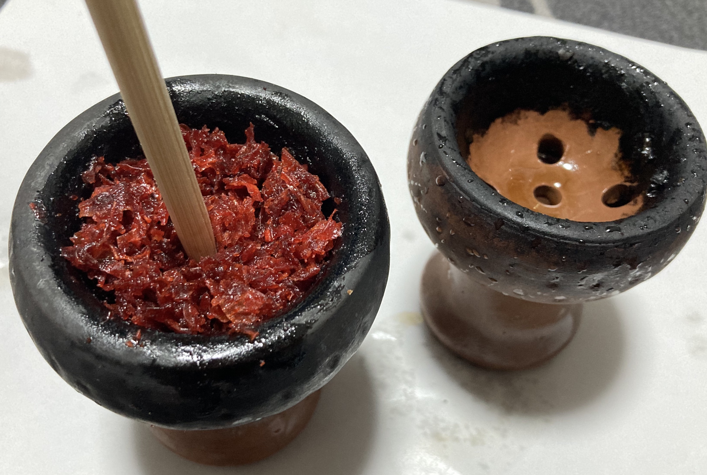
     - 図：フレーバーの盛り方

1. アルミホイルを張って穴をあける
   - フレーバーを盛ったらアルミホイルを張ろう。できるだけピンと貼ると良い。アルミホイルを張ったら爪楊枝などで穴を開ける。ボウルの最外周部に 1cm 間隔で 1 周、そこから内側に 8mm ほどずらした箇所に 1.5cm 間隔でもう 1 周穴をあける。穴の大きさはだいたい 0.5mm ほどを目安にするといい。
   - 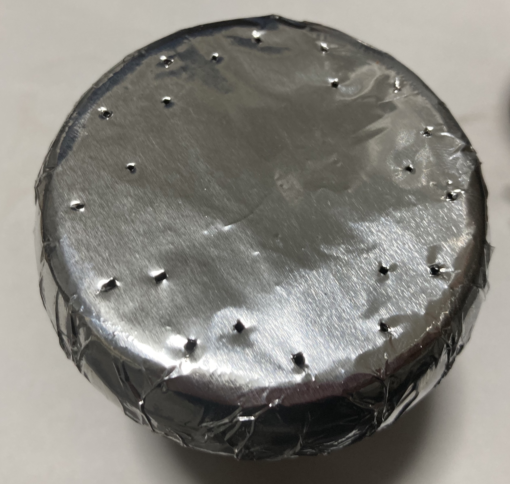
     - 図: 穴の開け方
1. ボウルをシーシャパイプの上に乗せる

   - アルミホイルを張ったらパイプの上に乗せよう。ぐらつかないようにしっかり抑え込む。このときにホースから吸ってボコボコ感をたしかめ、水の量を調整すると良い。

1. もう 1 枚アルミホイルを張る。
   - 炭を乗せる前にアルミホイルをもう一枚張ろう。このアルミホイルは穴を開けなくてよい。フレーバーを蒸らす間、このもう一枚のアルミホイルが蓋をすることで出来上がったシーシャが 1 段と美味しくなる。これで準備完了だ。

#### 立ち上げまで

1. 炭を乗せる

   - 事前準備が終わったらいよいよ炭を乗せる。ごみ取りネットをボウルに乗せて、焼いた炭を乗せよう。基本的に炭を乗せるときは等間隔でのせることがルールだ。炭を載せたら風防をかぶせる。
   - 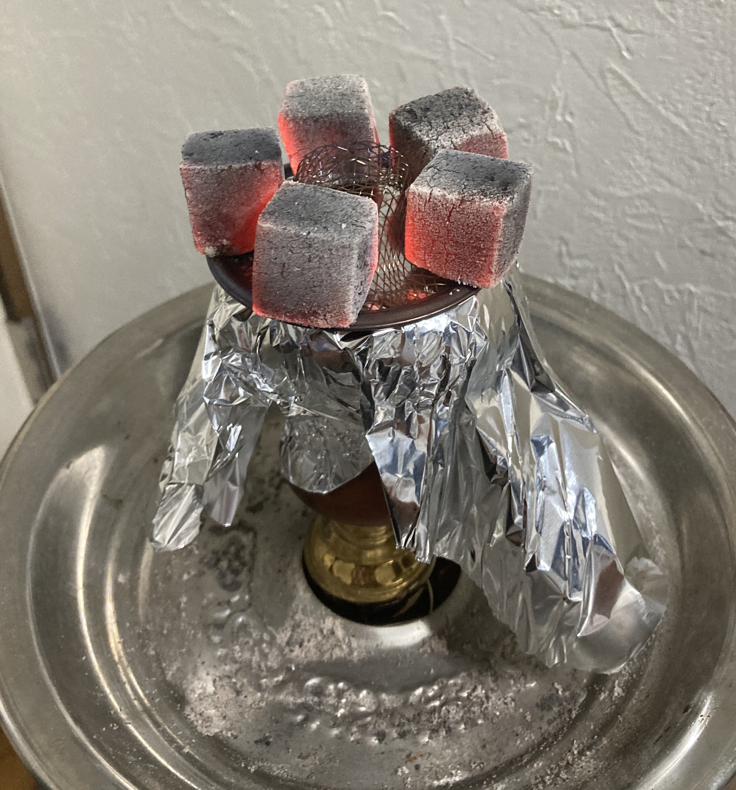
     - 図：ごみ取りネットと炭をボウルに乗せた様子
   - 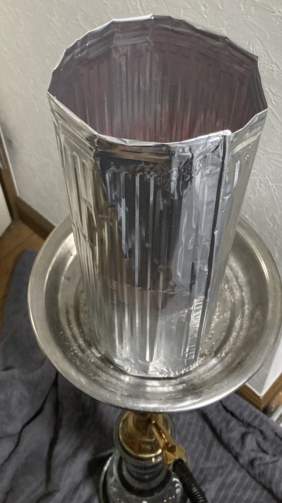
     - 図：風防をかぶせた様子(側面)
   - 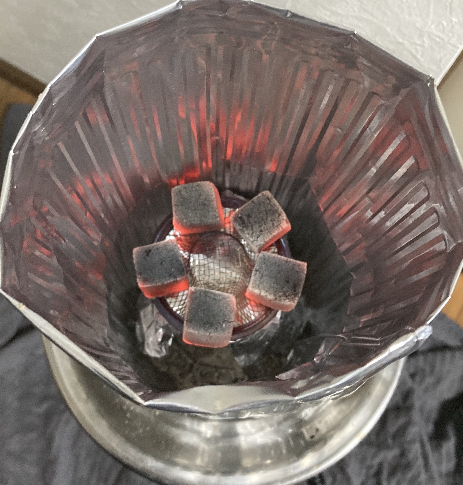
     - 図：風防をかぶせた様子(上から)

1. 待って蒸らす
   - 炭を載せたら蒸らす。炭の個数によるが、炭 5 個だと 5 分、炭 4 個だと 6 分ほどが目安。
1. 吸い出しする
   - 待ち時間が終わったらいよいよ吸い出しだ。一度風防を外し、炭とごみ取りネットをおろしてから、2 枚めに張った蓋のアルミホイルを剥がして、もう一度ごみ取りネットと炭を乗せ、風防をかぶせる。このときに炭は 4 個が目安。準備が終わったら吸い出しを開始する。吸い出し時は立った状態で吸い出しをすると体の負担が少ない。しっかり味が出てきたら吸い出しの完了だ。
1. 風防を外し、穴を増やして吸う
   - 吸い出しが終わったら風防を外し、炭を一度おろしてから穴を 8 つほど内側に開けると良い。はじめに穴を開けた状態だと、濃い煙を出しやすいものの、吸いにくくヤニクラがおこりやすいので穴を増やしてあげるとよい。これでシーシャの完成だ。

#### 炭変え、その他ポイントなど

煙の状態を見て、炭の量を 2〜4 個で調整しながら吸ってあげると良い。はじめに焼いた炭が半分くらいの大きさになってきたら次の炭を 4 つほど焼いて上げるといいだろう。炭が焼けるまでの間は風防を付けると火力を安定させることができる。

炭替えや火力調整はやはりコツがいるので、何回かやって慣れてほしい。

その他ポイントとして、ダブルアップルを美味しく作る方法を伝授したい。吸い出し時に高火力で焦げている味がし始めるまで熱を回し、その状態で一度炭を下ろす。そして、ホースから 1 度息を吹き込んだ後、炭がない状態で 2,3 回吸う。これで温度を下げた後、炭を 4 個のせて再度吸い出しをする。フレーバーの上面に焦げで蓋をすると、温度帯がちょうどよくなり、アップルの甘さがひきたつ。これがダブルアップルを作るコツである。

また、この一度炭を下ろしてから、息を吹き込んで炭なしで 2,3 度吸う方法は、温度が上がりすぎたときに火力をコントロールするテクニックでもあるので、ぜひ試してマスターしてほしい。以上がシーシャの作り方の基本である。

## あとがき

本項では、シーシャの成り立ちから、道具、作り方に至るまで今までに筆者が見知ったいろんな知識をできるかぎりまとめてみた。実のところ、同人誌への寄稿が初めてのため、文章や解説に至らぬ点がある旨ご容赦いただければ幸いだ。

今回のような機会をいただいた純喫茶同好会のメンバーの皆様、締切に間に合わず多々迷惑をおかけした編集担当に感謝したい。

また、執筆にあたり特にご協力いただいた方がお二方いらっしゃる。1 人目は、大阪日本橋のシーシャカフェ、「シフル」店長の新垣（しんがき）さん。シフルは自分が初めてシーシャを吸ったお店であり、新垣さんにはシーシャの文化、楽しさを教えていただいた。また、新垣さんには「今度留年したら出禁な」と激励いただいたことがきっかけとなり、無事単位をギリギリで取得し卒業できたという恩がある。新垣さんには、執筆に当たりシーシャの歴史項目の参考文献探しにご協力いただいた。
2 人目は、自由が丘のシーシャカフェ「カンノーク」店長の天明さん。カンノークさんは筆者が就職に伴う上京後とてもお世話になっている。天明さんとは公私ともに仲良くさせていただいており、自分の自宅シーシャスキルが上がったのは彼のおかげでもある。執筆に当たり、シーシャカフェでの注意点など複数の項目でご監修いただいた。
お二人のご協力なしには本項を執筆できなかったであろう。心より謝辞を申し上げさせていただきたい。

最後に、本項が読者にとって、深い深いシーシャ文化の沼に落ちるきっかけ、あるいはシーシャを楽しむ何らかのきっかけにつながれることを望んでやまない。

(2020 年 8 月中旬、締切を過ぎた数日後に)  
`Xijing`

## 出典、引用元など

下記リンク最終確認は 2020 年 8 月 20 日です

1. シーシャカフェ「North Village」さん、ホームページ ( https://shisha.tokyo/shisha/ ) より一部引用
2. 春日部のシーシャカフェ、「Patisa」の店長、キヤさん談。Japan Shisha Times ページのインタビュー記事 (https://japanshishatimes.jp/shishado-1-patisa/)より
3. 英語版 Wikipedia 「Hookah」記事の History 項目 (https://en.wikipedia.org/wiki/Hookah#History) より
4. Fumari 社ブログ記事 ( https://www.fumari.com/blog/hookah-history/ ) より
5. Yahoo Geocities 「水タバコのすすめ」ページの「ナハラ社潜入」記事 (http://www.geocities.co.jp/SilkRoad-Desert/9013/nakhla.html) より
   - Yahoo Geocities 終了に伴い現在リンク切れ。Internet Archive にて確認可能です。
